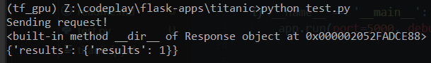

# Deploying a machine learning model using flask

https://towardsdatascience.com/create-an-api-to-deploy-machine-learning-models-using-flask-and-heroku-67a011800c50

TODO
1. Creating and pikling a model on titanic data - Done

2. creating a flask app -Done
3. test flask app locally - Done

4. deploying to heroku

5. test working app